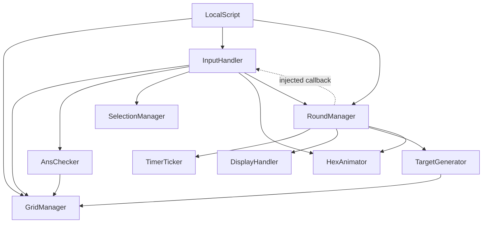

# Doc A — Appendices

Single source of truth for the **Feature Status Matrix** and the **Dependency graph**. Other docs reference these; if a status tag changes, change it here first.

---

## A1 — Feature Status Matrix

Authoritative build-state index. Where prose elsewhere disagrees, this wins.

| Feature | Status | Owner | Doc | Note |
| :-- | :-- | :-- | :-- | :-- |
| Core round loop | ✅ | RoundManager | 1 | No win condition — loops indefinitely |
| Dependency layering | ✅ | all | 0, A2 | Acyclic via injected callback |
| Source-of-truth by reference | ✅ | GridManager | 2 | `grid[q][r]` passed by reference |
| Confirmation-window race guards | ✅ | InputHandler | 1 | `lockedCount` + `submissionID` |
| Target frequency lottery | ✅ | TargetGenerator | 3 | Precomputed `ALL_LINES` (27 lines) |
| Dual-timer reconciliation | ✅ | DisplayHandler | 4 | String-coercion dependency — see Doc 4 |
| Score stale-drop guard | ✅ | DisplayHandler | 4 | `scoreID` check |
| Answer validation (connect + straight) | ✅ | AnsChecker | 3 | Node-count enforced in InputHandler |
| Memorization phase (30s) | ✅ | RoundManager | 1 | Timer chains into first round; hex value→letter swap |
| Letter identifiers | ✅ | GridManager | 2 | Hand-ordered `AVAILABLE_LETTERS`; I/O not yet omitted |
| Memorization hex tween + font flip | ✅ | HexAnimator + RoundManager | 4 | Part tween in HA; font `TextColor3` write in RM (split boundary) |
| Win condition (5/6 rounds) | 🟡 | RoundManager | X | `currRound` increments, never read — next feature |
| Mistake budget (1 allowed) | 📋 | RoundManager | X | — |
| Mistake compensation (15→20s) | 📋 | RoundManager | X | — |
| Dynamic board updates (3 hexes ±3) | 📋 | GridManager | X | — |
| Solution reveal + target blacklist | 📋 | AnsChecker + TargetGenerator | X | — |

**Legend:** ✅ Implemented · 🟡 Partial · 📋 Spec-only

---

## A2 — Dependency Graph

Solid = `require` (higher → lower). Dashed = injected callback (lower → higher). The single dashed edge keeps the graph acyclic.



**Edge list:**

```
LocalScript      → GridManager, InputHandler, RoundManager
InputHandler     → GridManager, AnsChecker, SelectionManager, HexAnimator, RoundManager
RoundManager     → TimerTicker, DisplayHandler, TargetGenerator, HexAnimator
AnsChecker       → GridManager
TargetGenerator  → GridManager
GridManager, SelectionManager, TimerTicker, DisplayHandler → (none)
HexAnimator      → TweenService (engine only)
```

**Acyclicity:** `InputHandler` requires `RoundManager`; `RoundManager` reaches back only via the callback `LocalScript` injects at composition time. Remove that indirection and the pair becomes a circular `require`.
